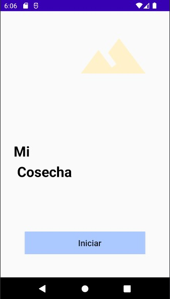
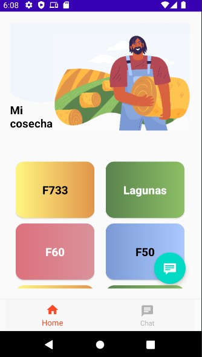
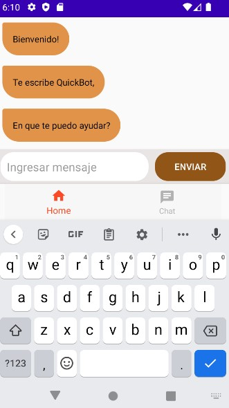
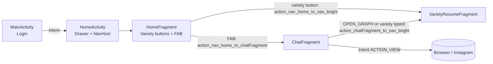
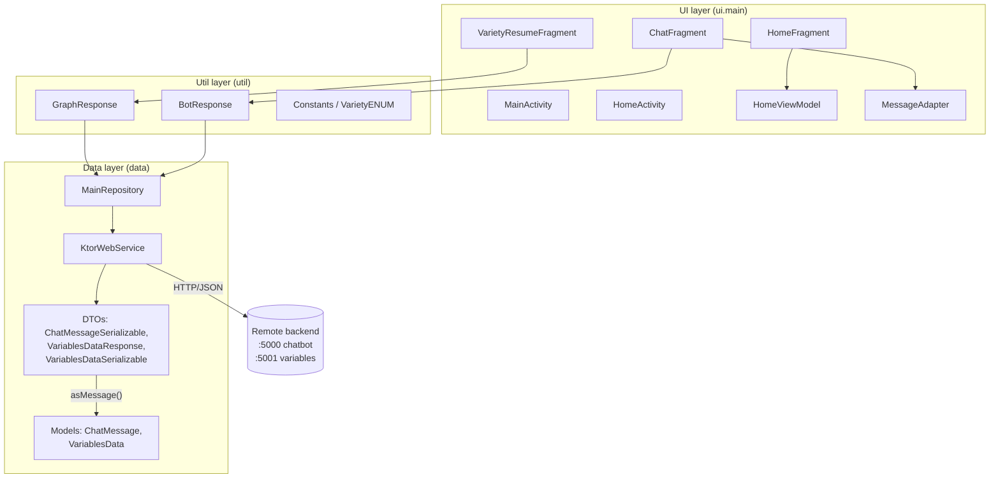
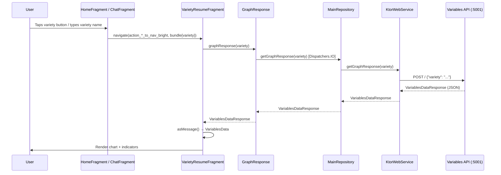

# MiCosecha Mobile

Android application (Kotlin) that gives farmers a quick way to explore **crop-variety information** (climate variables, historical and predicted yield, and a recommended sowing period) through two entry points:

1. A **variety catalogue** (home screen with one button per variety).
2. A **chatbot** that understands natural-language commands and can open the same variety dashboards, a Google search, or Instagram.

The app is a thin client: all intelligence (chatbot NLU, yield prediction, climate aggregation) lives in **external backend services** that are *not* part of this repository.

> The UI language is **Spanish**; the code, comments and this documentation are in English.
> The domain appears to be rice cultivation (varieties such as F733, Lagunas, F60, F50, F473, Cimarrón Barinas, F2000, Only Rice 228 and Colombia XXI).

---

## Table of contents

1. [Key facts](#key-facts)
2. [Features](#features)
3. [Screenshots](#screenshots)
4. [Screens and navigation](#screens-and-navigation)
5. [Tech stack and libraries](#tech-stack-and-libraries)
6. [Architecture](#architecture)
7. [Design patterns used](#design-patterns-used)
8. [Project structure](#project-structure)
9. [Backend API contract](#backend-api-contract)
10. [Chatbot command protocol](#chatbot-command-protocol)
11. [Getting started (installation)](#getting-started-installation)
12. [Configuration](#configuration)
13. [Troubleshooting build problems](#troubleshooting-build-problems)
14. [Known issues and technical debt](#known-issues-and-technical-debt)
15. [Suggested roadmap](#suggested-roadmap)
16. [Contributing](#contributing)
17. [License](#license)

---

## Key facts

| Item | Value |
|---|---|
| App name | `MiCosecha_mobile` (Gradle root project; single module `:app`) |
| Application ID / package | `com.mobile.micosecha` |
| Minimum SDK | `19` (Android 4.4) |
| Target SDK | `31` |
| Compile SDK | `31` |
| Version | `versionCode 1` / `versionName "1.0"` |
| Launcher activity | `com.mobile.micosecha.ui.main.view.MainActivity` (login); `HomeActivity` is the main shell |
| Theme | `NoActionBar` variants for the primary activities |
| AndroidX | Enabled, with **Jetifier** turned on in Gradle properties |
| Language | Kotlin |
| License | MIT (see `LICENSE` in the repository root) |

**Key files**

- `app/src/main/AndroidManifest.xml`: manifest, permissions and launcher activity.
- `app/build.gradle`: SDK levels, application ID and dependencies.
- `app/src/main/java/com/mobile/micosecha/`: application source code.
- `app/src/main/res/`: layouts, navigation graph, menus and strings.

---

## Features

- **Login screen** that leads to the main shell (currently a simple button, with no real authentication).
- **Navigation drawer** shell (`HomeActivity`) hosting a Jetpack Navigation graph.
- **Variety catalogue**: one button per variety (F733, Lagunas, F60, F50, F473, Cimarrón, F200/F2000, Only Rice, Colombia XXI).
- **Variety dashboard** (`VarietyResumeFragment`):
  - Animated historical line chart (WilliamChart).
  - Predicted yield for the following years.
  - Climate indicators: minimum/maximum temperature, relative humidity, sun brightness, precipitation.
  - Current production figure.
  - Recommended sowing period (the bi-semester with the highest average yield).
- **Chatbot** (`ChatFragment`):
  - RecyclerView-based conversation UI with user and bot bubbles.
  - Scripted welcome messages with a randomly chosen bot name.
  - Sends messages to a remote NLU service and reacts to special responses (open graph, open Google, open Instagram).
  - Typing a variety name directly jumps to that variety's dashboard.
  - Tap a message to remove it from the conversation.

---

## Screenshots

The images live in the [`demo`](demo) folder at the repository root.

<table>
  <tr>
    <td align="center"><b>Welcome</b></td>
    <td align="center"><b>Home</b></td>
    <td align="center"><b>Chat</b></td>
  </tr>
  <tr>
    <td></td>
    <td></td>
    <td></td>
  </tr>
</table>

| Screenshot | Screen | Description |
|---|---|---|
| `demo/welcome_screen.jpg` | `MainActivity` | Welcome / login screen that leads to the app. |
| `demo/home_screen.jpg` | `HomeFragment` | Home screen with the variety catalogue and the floating button that opens the chat. |
| `demo/chat_screen.jpg` | `ChatFragment` | Chatbot conversation. |

---

## Screens and navigation



Navigation arguments are passed with a `Bundle` containing a single key: `"variety"` (String).

---

## Tech stack and libraries

> Versions marked **(from build files)** were taken from the project's Gradle configuration. The others are inferred from the imports in the source code, so please check `app/build.gradle` for the exact versions.

| Area | Library / tool | Notes |
|---|---|---|
| Language | **Kotlin 1.7.10** (from build files) | Includes coroutines and `kotlinx.serialization`. |
| Build | **Android Gradle Plugin 7.2.2**, **Gradle 7.3.3** (from build files) | Requires **JDK 11 or 17** (not 21). |
| UI | AndroidX, Material Components | `Fragment`, `RecyclerView`, `NavigationView`, `FloatingActionButton`, `Snackbar`. |
| UI binding | **Data Binding** and **View Binding** | Both are used (see [Design patterns](#design-patterns-used)). |
| Legacy UI binding | `kotlin-android-extensions` (`kotlinx.android.synthetic`) | **Deprecated**; still used in `MessageAdapter` and `HomeFragment`. |
| Navigation | **Jetpack Navigation** + **Safe Args** plugin | Version via `$nav_version` in the root `build.gradle`. |
| Architecture components | `ViewModel` (`androidx.lifecycle`) | Used in `HomeViewModel`. |
| Networking | **Ktor Client 2.x** (`CIO` engine, `ContentNegotiation`) | Package names (`io.ktor.client.plugins.*`) indicate Ktor 2.x. |
| Serialization | **kotlinx.serialization (JSON)** | `ktor-serialization-kotlinx-json` + `kotlin-serialization` plugin. |
| Concurrency | **Kotlin Coroutines** | `Dispatchers.IO` in the repository, `Dispatchers.Main` in the UI. |
| Charts | **WilliamChart** (`com.diogobernardino:williamchart:3.11.0`) | `LineChartView` for the history chart. Available on Maven Central. |
| Annotation processing | `kapt` | Required by Data Binding with Kotlin. |

### Declared dependencies of interest

From `app/build.gradle` (exact versions are defined there):

| Dependency | Purpose |
|---|---|
| `androidx.core:core-ktx` | Kotlin extensions for the Android framework (e.g. `bundleOf`). |
| `androidx.constraintlayout:constraintlayout` | Layouts. |
| `androidx.lifecycle:lifecycle-runtime-ktx` | Lifecycle-aware coroutine support. |
| `androidx.lifecycle:lifecycle-viewmodel-ktx` | `ViewModel` Kotlin extensions. |
| `androidx.navigation:navigation-fragment-ktx` | Navigation host and fragment destinations. |
| `androidx.navigation:navigation-ui-ktx` | Drawer/`NavigationView` integration (`setupWithNavController`). |
| `io.ktor:ktor-client-core` | Ktor client core. |
| `io.ktor:ktor-client-cio` | CIO engine used by `HttpClient(CIO)`. |
| `io.ktor:ktor-client-content-negotiation` | JSON content negotiation plugin. |
| `io.ktor:ktor-serialization-kotlinx-json` | Ktor ↔ kotlinx.serialization bridge. |
| `org.jetbrains.kotlinx:kotlinx-serialization-json` | JSON (de)serialization of the DTOs. |
| `com.diogobernardino:williamchart` | Line chart (`LineChartView`). |

---

## Architecture

The app follows a **layered, MVVM-leaning architecture** with a repository for remote data:



### Layers

**UI layer (`ui.main`)**
Activities host the screens; Fragments render and react to user input. `HomeViewModel` currently only encapsulates the navigation click handler used by Data Binding. `MessageAdapter` renders the chat list.

**Util layer (`util`)**
Acts as a lightweight *use-case / interactor* layer. `BotResponse` and `GraphResponse` wrap the repository, switch to `Dispatchers.IO`, and (in the bot's case) sanitize the input. `Constants` holds the chat protocol strings and `VarietyENUM` lists the supported varieties.

**Data layer (`data`)**
- `KtorWebService`: the HTTP client and the only class that knows endpoints and wire formats.
- `MainRepository`: single entry point for remote data; moves calls to `Dispatchers.IO`.
- `data.api`: wire DTOs annotated with `@Serializable` and plain Kotlin models used by the UI, linked by mapper extension functions (`asMessage()`).

### Data flow example: opening a variety dashboard



---

## Design patterns used

| Pattern | Where | Description |
|---|---|---|
| **Layered architecture** | Whole project | Clear separation between UI, utility/use-case wrappers and data. |
| **MVVM (partial)** | `HomeFragment` + `HomeViewModel` + Data Binding | The ViewModel is bound in `fragment_home` and handles button clicks. The chat and dashboard screens still hold logic in the Fragment. |
| **Repository** | `MainRepository` | Abstracts the data source behind a suspend API. |
| **Data Transfer Object + Mapper** | `*Serializable` / `*Response` → `ChatMessage` / `VariablesData` via `asMessage()` | Decouples the wire format from UI models. |
| **Adapter** | `MessageAdapter` (RecyclerView) | Adapts `ChatMessage` objects to chat bubbles, choosing the bubble by `id` (`SEND_ID` / `RECEIVE_ID`). |
| **Single-Activity-per-flow + Navigation component** | `HomeActivity` + nav graph | Fragments navigate through typed actions and a `Bundle`. |
| **Command protocol over text** | `Constants.OPEN_*` | Special bot responses trigger client-side actions (see [below](#chatbot-command-protocol)). |
| **Extension functions** | `asMessage()`, `enumContains<T>()` | Idiomatic Kotlin mapping and helpers. |
| **Observer (lifecycle owner)** | `binding.lifecycleOwner` | Data Binding bound to the lifecycle. |

---

## Project structure

**Repository layout**

```
MiCosecha_mobile
├── app                      # Android application module
├── demo                     # Screenshots used in this README
│   ├── chat_screen.jpg
│   ├── home_screen.jpg
│   └── welcome_screen.jpg
├── gradle/wrapper
├── build.gradle
├── settings.gradle
├── LICENSE
└── README.md
```

**Source package layout** (`app/src/main/java`)

```
com.mobile.micosecha
├── data
│   ├── api
│   │   ├── ChatMessage                    # UI model for a chat bubble
│   │   ├── ChatMessageSerializable.kt     # DTO + asMessage() mapper
│   │   ├── VariablesData                  # UI model for a variety dashboard
│   │   ├── VariablesDataResponse.kt       # DTO + asMessage() mapper
│   │   └── VariablesDataSerializable      # Request body for the variables API
│   └── repository
│       ├── MainRepository                 # Repository (IO dispatcher)
│       └── remote
│           └── KtorWebService             # Ktor HTTP client and endpoints
├── ui.main
│   ├── view
│   │   ├── adapter
│   │   │   └── MessageAdapter             # RecyclerView adapter for the chat
│   │   ├── ChatFragment                   # Chatbot screen
│   │   ├── HomeActivity                   # Drawer + NavHostFragment
│   │   ├── HomeFragment                   # Variety catalogue + FAB to chat
│   │   ├── MainActivity                   # Login screen
│   │   └── VarietyResumeFragment          # Variety dashboard (chart + indicators)
│   └── viewmodel
│       └── HomeViewModel                  # Navigation click handler
└── util
    ├── BotResponse                        # Sanitizes input, calls chatbot API
    ├── Constants                          # Chat IDs and command strings
    ├── GraphResponse                      # Calls the variables API
    └── VarietyENUM                        # Supported varieties
```

**Key resources** referenced from code: layouts `activity_main`, `activity_home`, `content_home`, `fragment_home`, `fragment_chat`, `fragment_bright`, `message_item`; menu `main`; nav destinations/actions `action_nav_home_to_chatFragment`, `action_nav_home_to_nav_bright`, `action_chatFragment_to_nav_bright`; nav host `nav_host_fragment_content_main`.

---

## Backend API contract

The app expects two HTTP services. Their base URLs are **hard-coded** in `KtorWebService` (see [Configuration](#configuration)). Both use `POST /` with `Content-Type: application/json`.

### 1. Chatbot service (port `5000`)

**Request**

```json
{
  "message": "HELLOHOWAREYOU",
  "id": "SEND_ID"
}
```

> `message` is upper-cased by the UI and stripped of `?`, `,`, `.`, `!` and spaces by `BotResponse.filterString()` before being sent.

**Response**

```json
{
  "message": "Some bot reply",
  "id": "RECEIVE_ID"
}
```

### 2. Variables service (port `5001`)

**Request**

```json
{ "variety": "F60" }
```

**Response** (`VariablesDataResponse`)

```json
{
  "lineSet": { "2018": 5.2, "2019": 5.6, "2020": 5.9 },
  "min_temp": 21.4,
  "max_temp": 33.1,
  "rhum": 78.5,
  "sbright": 215.3,
  "prec": 1200.0,
  "predictedLineSet": { "2024": 6.1, "2025": 6.2 },
  "yield_data": ["1st", "6.4"],
  "prod": 5.8
}
```

| Field | Type | Meaning / UI usage |
|---|---|---|
| `lineSet` | `LinkedHashMap<String, Float>` | Historical series (label → value). Chart is hidden when it has ≤ 1 entry. Insertion order matters. |
| `predictedLineSet` | `LinkedHashMap<String, Float>` | Predicted yield per period, listed as text. Hidden when ≤ 1 entry. |
| `min_temp`, `max_temp` | `Float` | Shown in °C. |
| `rhum` | `Float` | Relative humidity, shown in %. |
| `sbright` | `Float` | Sun brightness, shown as `w.m-2`. |
| `prec` | `Float` | Precipitation, shown in mm. |
| `prod` | `Float` | Production, shown with the `Ha` unit. |
| `yield_data` | `ArrayList<String>` | **Exactly two items**: `[0]` best sowing bi-semester, `[1]` its average production. |

The JSON parser is configured with `prettyPrint = true` and `isLenient = true`. It does **not** set `ignoreUnknownKeys`, so extra fields in the backend response will cause deserialization errors.

---

## Chatbot command protocol

The chatbot service can answer with **magic strings** that the client interprets as actions (see `Constants.kt` and `ChatFragment.botResponse()`):

| Bot response (`message`) | Constant | Client action |
|---|---|---|
| `Abriendo grafica...` | `OPEN_GRAPH` | Navigates to `VarietyResumeFragment`. |
| `Abriendo google...` | `OPEN_SEARCH` | Opens `https://www.google.com/search?&q=<term>` in the browser. |
| `Abriendo instagram...` | `OPEN_INSTA` | Opens `https://www.instagram.com/` in the browser. |
| Any other text | — | Shown as a normal bot bubble. |

Additionally, **before** calling the bot, the client checks whether the user's message (upper-cased) matches an entry name of `VarietyENUM`. If so, it skips the bot and navigates directly to the dashboard.

> `OPEN_GOOGLE` (`"Buscando..."`) is declared but currently unused.

---

## Getting started (installation)

### Prerequisites

| Requirement | Version |
|---|---|
| Android Studio | A version that supports AGP 7.2.2 (Chipmunk or newer works; recent releases are fine) |
| **JDK for Gradle** | **11 or 17**. **JDK 21 is not supported** by Gradle 7.3.3 |
| Gradle | **7.3.3** (via the wrapper) |
| Android SDK | **Platform 32** (`compileSdk`), installed through the SDK Manager. The app targets API 31 and supports devices from **API 19** |
| Backend services | Chatbot on port `5000` and variables API on port `5001` (see [API contract](#backend-api-contract)) |

### Steps

1. **Clone the repository**

   ```bash
   git clone <repository-url>
   cd MiCosecha_mobile
   ```

2. **Open the project** in Android Studio (*File → Open* and select the root folder).

3. **Select the right JDK**
   *Settings → Build, Execution, Deployment → Build Tools → Gradle → Gradle JDK* → choose **JDK 17** (or 11).

4. **Verify the Gradle wrapper** (`gradle/wrapper/gradle-wrapper.properties`):

   ```properties
   distributionUrl=https\://services.gradle.org/distributions/gradle-7.3.3-bin.zip
   ```

5. **Verify the repositories** in `settings.gradle`:

   ```groovy
   dependencyResolutionManagement {
       repositoriesMode.set(RepositoriesMode.FAIL_ON_PROJECT_REPOS)
       repositories {
           google()
           mavenCentral()
           maven { url 'https://jitpack.io' }
       }
   }
   rootProject.name = "MiCosecha_mobile"
   include ':app'
   ```

6. **Sync Gradle** (*File → Sync Project with Gradle Files*).

7. **Start the backend services** and set their address (see [Configuration](#configuration)).

8. **Run the app** on an emulator or a physical device (*Run ▶ app*), or from the command line:

   ```bash
   # Linux / macOS
   ./gradlew assembleDebug
   # Windows
   gradlew.bat assembleDebug
   ```

   The APK is generated in `app/build/outputs/apk/debug/`.

---

## Configuration

### Backend URLs

Currently hard-coded in `data/repository/remote/KtorWebService.kt`:

```kotlin
ktorHttpClient.post("http://192.168.56.1:5000/") { ... }  // chatbot
ktorHttpClient.post("http://192.168.56.1:5001/") { ... }  // variables API
```

`192.168.56.1` is the typical address of a VirtualBox host-only adapter on the development machine. Adjust it to your environment:

| Where the app runs | Host to use |
|---|---|
| Android Emulator, backend on the same PC | `10.0.2.2` |
| Physical device on the same Wi-Fi | The PC's LAN IP (e.g. `192.168.1.x`) |
| Production | A proper HTTPS domain |

### Network permissions and cleartext traffic

The backend is called over plain **HTTP**. On Android 9+ (API 28+), cleartext traffic is blocked by default, so make sure that:

- `AndroidManifest.xml` declares `<uses-permission android:name="android.permission.INTERNET" />`.
- Cleartext is allowed for development, either with `android:usesCleartextTraffic="true"` on `<application>` or with a `network_security_config.xml` limited to your dev hosts.
- The host firewall allows inbound connections on ports `5000` and `5001`.

> Do **not** ship cleartext traffic to production. Move to HTTPS.

### SDK levels: things to be aware of

- **`minSdk 19`** is very low. Check that the Ktor client (CIO engine) works on the oldest devices you intend to support; if you need to support API 19 in practice, test on a real API 19-20 device or emulator. On those versions, TLS 1.2 is not enabled by default, which can break HTTPS once you move away from plain HTTP.
- **`targetSdk 31` / `compileSdk 32`** are outdated. Google Play requires a much more recent `targetSdk` for new apps and updates, so raising it will be necessary before publishing. Expect behavior changes (e.g. exported components, notification and storage permissions).
- `ChatFragment` uses `@RequiresApi(Build.VERSION_CODES.O)` on several methods. Those annotations only affect lint; they do not guard calls at runtime on older devices.

---

## Troubleshooting build problems

These are issues commonly hit when opening this (older) project with a modern IDE.

| Symptom | Cause | Fix |
|---|---|---|
| `IncrementalTaskInputs is not a valid parameter to an action method` (`DataBindingGenBaseClassesTask`) | AGP 7.2.2 running on Gradle 8.x | Use Gradle **7.3.3** with AGP 7.2.2, **or** upgrade AGP/Kotlin and keep Gradle 8.x. |
| `Your build is currently configured to use incompatible Java 21 and Gradle 7.3.3` | Android Studio's bundled JDK 21 | Set *Gradle JDK* to **17** (or 11). Also check `JAVA_HOME` and any `org.gradle.java.home` in `gradle.properties`. |
| `Could not find com.diogobernardino:williamchart:3.7.0` | Old version only hosted on the discontinued **JCenter** | Use `implementation 'com.diogobernardino:williamchart:3.11.0'` (Maven Central). |
| `Could not find com.diogobernardino.williamchart:williamchart:3.10.1` | Wrong group ID for the main artifact | The main library uses group `com.diogobernardino` (no `.williamchart` suffix). |
| Other `Could not find ...` errors | Other dependencies hosted on JCenter | Find the new coordinates on Maven Central / JitPack. Remove any `jcenter()` entry. |
| Repository errors with `FAIL_ON_PROJECT_REPOS` | `repositories {}` blocks in module `build.gradle` or `allprojects` | Keep repositories only in `settings.gradle`. |
| Warnings about `kotlin-android-extensions` and `kapt.use.worker.api` | Deprecated plugin / option | Not blocking. See [roadmap](#suggested-roadmap) to migrate to View Binding. |

After changing JDK or wrapper versions, stop stale daemons and re-sync:

```bash
./gradlew --stop
./gradlew clean
```

### Optional: modernizing the toolchain

If you want to keep working on the project long-term, consider upgrading to **AGP 8.x + Gradle 8.x + Kotlin 1.9.x + JDK 17**. This implies: adding `namespace` in `app/build.gradle`, removing `package` from the manifest, enabling `buildFeatures { buildConfig true }` if `BuildConfig` is used, and replacing `kotlin-android-extensions` with View Binding.

---

## Known issues and technical debt

Observed while reviewing the source. None of them prevent the app from compiling, but they are worth addressing.

**Networking and error handling**
- No `try/catch` around network calls. If a backend is down or unreachable, an exception inside `GlobalScope.launch` will **crash the app**.
- Hard-coded base URLs (see [Configuration](#configuration)); no `BuildConfig` flavors for dev/prod.
- Plain HTTP and no authentication/authorization.
- `KtorWebService` is instantiated again in `BotResponse` and `GraphResponse`, which means **multiple `HttpClient` instances** are created and never closed.
- JSON config lacks `ignoreUnknownKeys = true`.

**Coroutines and lifecycle**
- `GlobalScope.launch` is used in `ChatFragment` and `VarietyResumeFragment`. It is not lifecycle-aware, so work continues after the view is destroyed.
- In `VarietyResumeFragment`, `binding` (`_binding!!`) is accessed after the network call returns. If the user navigates away first, it can throw a `NullPointerException`.
- `ChatFragment.binding` is a `lateinit` that is never cleared in `onDestroyView`, which can leak the view.

**Correctness**
- `HomeActivity.onSupportNavigateUp()` uses `appBarConfiguration`, which is declared `lateinit` but **never initialized** → `UninitializedPropertyAccessException` if the up button is triggered.
- The fallback text in `VarietyResumeFragment` uses `.also { "Temperature: NaN" }`, which has **no effect** (the lambda result is discarded). The "NaN" defaults never apply.
- `yield_data[0]` and `yield_data[1]` are accessed unconditionally → `IndexOutOfBoundsException` when the backend returns fewer than two items.
- In `ChatFragment`, the message is upper-cased before `botResponse(...)`, but the Google search term is extracted with `substringAfterLast("google")` (lower-case). The delimiter is never found, so the **whole upper-cased message** is used as the search term.
- The variety sent to the backend is the user's raw upper-cased text / enum **name** (e.g. `RICE_228`), while `VarietyENUM.variety` (e.g. `"ONLY RICE 228"`) is not used anywhere. Make sure the backend expects the same identifiers.
- Possible variety mismatch: the enum defines `F2000` while the button id is `F200Button`.
- `onCreateView` in `ChatFragment` calls `super.onCreate(savedInstanceState)` instead of relying on the default lifecycle.

**Code quality**
- `MessageAdapter.insertMessage()` calls both `notifyItemInserted` and `notifyDataSetChanged`; only the first is needed. Also, `messagesList` is duplicated in `ChatFragment` and `MessageAdapter`.
- `HomeViewModel.onClick` repeats the same `navigate` call in every `when` branch.
- `HomeViewModel` holds a `View` and the NavController lookups, which couples it to the UI. Navigation should be triggered from the Fragment (or via a navigation event).
- Use of `kotlinx.android.synthetic` (deprecated and removed in newer Kotlin versions).
- No dependency injection; dependencies are created inline.
- User-facing strings are hard-coded in Kotlin instead of `strings.xml`.
- No tests are present.

---

## Suggested roadmap

1. **Stability**: add error handling (`runCatching`/`try-catch`), loading and error states, and retries.
2. **Lifecycle**: replace `GlobalScope` with `viewModelScope` / `viewLifecycleOwner.lifecycleScope`; create `ChatViewModel` and `VarietyViewModel` exposing `StateFlow`/`LiveData`.
3. **Dependency injection**: introduce Hilt (or Koin) and provide a single `HttpClient`, `KtorWebService` and `MainRepository`.
4. **Configuration**: move base URLs to `BuildConfig` / product flavors; use HTTPS.
5. **Remove deprecated APIs**: migrate from `kotlinx.android.synthetic` to View Binding.
6. **Domain layer**: replace `BotResponse` / `GraphResponse` with proper use cases; use `ListAdapter` + `DiffUtil` in the chat.
7. **Localization**: extract strings into `strings.xml` (es/en).
8. **Testing**: unit tests for mappers, repository (Ktor `MockEngine`) and ViewModels; UI tests for navigation.
9. **Toolchain and SDK**: upgrade to AGP 8.x / Gradle 8.x / Kotlin 1.9+, and raise `compileSdk` / `targetSdk` (currently 32 / 31) to meet Google Play requirements. Reconsider `minSdk 19`.
10. **Authentication**: replace the placeholder login with a real flow if user accounts are needed.

---

## Contributing

1. Fork the repository and create a feature branch (`git checkout -b feature/my-change`).
2. Keep the package layout (`data`, `ui.main`, `util`) and prefer adding new logic to ViewModels/repositories rather than Fragments.
3. Make sure the project builds with `./gradlew assembleDebug` on JDK 17.
4. Open a pull request describing the change and how to test it.

---

## License

This project is distributed under the **MIT License**. See the `LICENSE` file in the repository root for details.